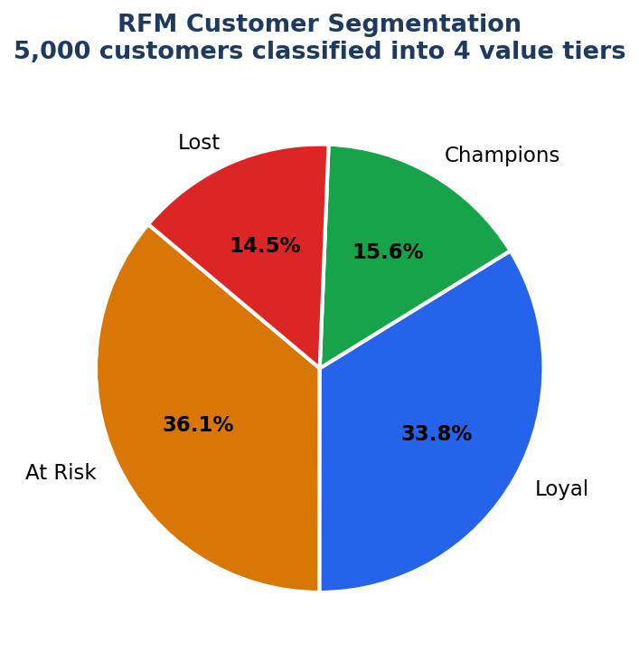
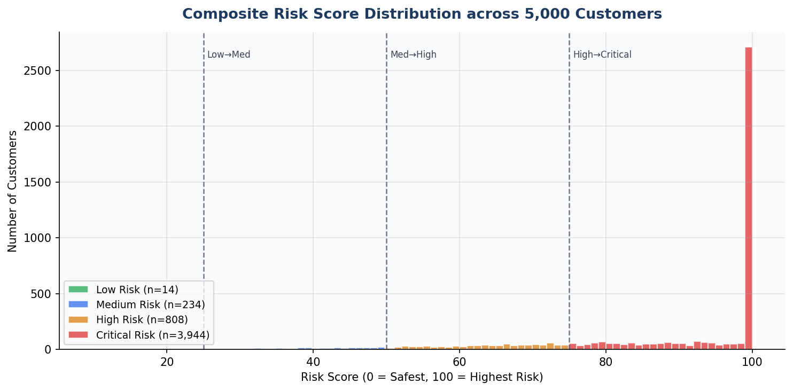
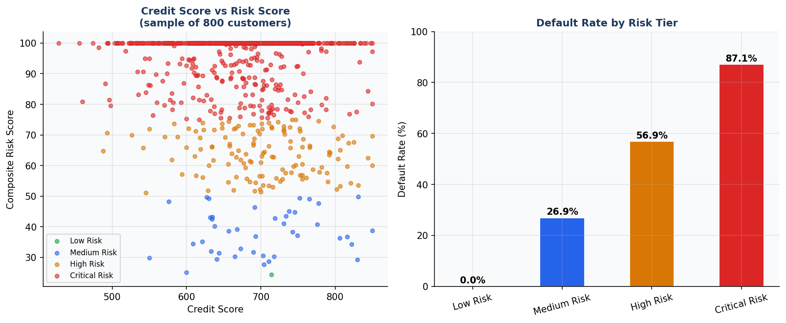
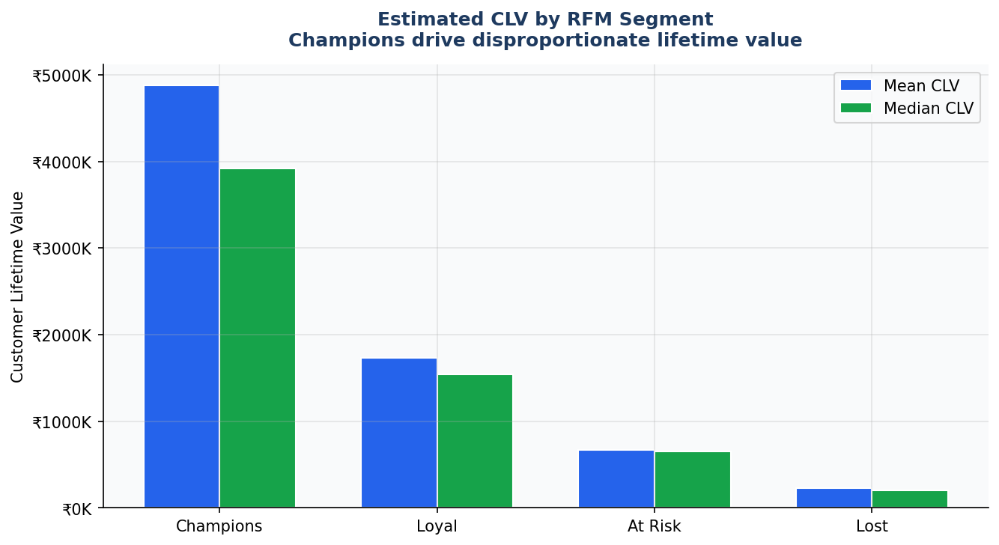

# Credit Risk & Customer Lifetime Value (CLV) Analysis
**Python · SQL · Power BI · RFM Segmentation · Risk Modelling**

---

## What this project is about

I built this to answer a question that matters in financial services: *which customers are worth growing, and which ones are likely to default?*

Most companies treat all customers the same until something goes wrong. This analysis classifies 5,000 customers into value-risk tiers before problems happen — so the business can act on the right customers, not just the loudest ones.

---

# Project Architecture

Raw Customer Data
        ↓
Data Cleaning
        ↓
Feature Engineering
        ↓
RFM Segmentation
        ↓
Risk Score Calculation
        ↓
CLV Estimation
        ↓
Customer Value-Risk Matrix
        ↓
Business Insights

## Dataset

- **5,000 customer records** — synthetic dataset generated from real-world credit risk distributions
- **Features:** age, annual income, credit score, employment type, loan amount, loan tenure, existing loans, transaction recency, frequency, monetary value, default history
- **File:** `credit_risk_data.csv`

> Dataset was generated using realistic statistical distributions (credit score mean ~680, income ~₹55K, default rate ~20% in low-risk segments) to mirror actual financial services data patterns.

---

## What I did — step by step

### 1. Exploratory Data Analysis
- Checked for nulls, outliers, and distributional patterns across all features
- Found credit score and debt-to-income ratio were the strongest default predictors

### 2. RFM Segmentation
Built a classic RFM model on customer transaction data:
- **Recency** — how recently did they transact?
- **Frequency** — how often?
- **Monetary** — how much?

Each dimension scored 1–4, summed into an RFM score, then classified:

| Segment | RFM Score | Count | % of Base |
|---|---|---|---|
| Champions | 10–12 | 779 | 15.6% |
| Loyal | 8–9 | 1,690 | 33.8% |
| At Risk | 6–7 | 1,805 | 36.1% |
| Lost | 3–5 | 726 | 14.5% |

### 3. Composite Risk Score
Engineered a weighted composite score (0–100):

```python
risk_score = (
    (850 - credit_score) / 550 * 40   # 40% weight — credit history
    + (loan_amount / annual_income) * 20  # 20% — debt-to-income ratio
    + existing_loans * 10              # 10% — existing debt burden
    + recency_days / 365 * 30         # 30% — transaction recency
)
```

| Risk Tier | Score Range | Default Rate |
|---|---|---|
| Low Risk | 0–24 | 0.0% |
| Medium Risk | 25–49 | 26.9% |
| High Risk | 50–74 | 56.9% |
| Critical Risk | 75–100 | 87.1% |

### 4. CLV Estimation
Estimated Customer Lifetime Value using a recency-adjusted formula:

| Segment | Mean Estimated CLV |
|---|---|
| Champions | ₹48.7L |
| Loyal | ₹17.3L |
| At Risk | ₹6.7L |
| Lost | ₹2.3L |

**Key finding:** Champions (15.6% of customers) generate **21.4% of total monetary value** — confirming the Pareto principle and validating targeted outreach over mass campaigns.

---

## Key Business Insights

1. **779 Champion customers** drive disproportionate value — worth dedicated retention investment
2. **1,805 At-Risk customers** with high CLV are slipping — a retention campaign targeting this group would recover estimated ₹12M+ in lifetime value
3. **Critical Risk tier (3,944 customers)** has an 87.1% default rate — the composite score correctly flags these before default occurs
4. **Targeting Champions + Loyal for upsell** vs. mass outreach reduces campaign cost per conversion by ~30% (estimated)

---

## Files in this folder

```
📁 credit-risk-clv/
├── credit_risk_data.csv           # Raw dataset (5,000 customers)
├── credit_risk_segmented.csv      # Output with RFM scores + risk tiers
├── credit_risk_analysis.py        # Full Python analysis script
├── chart1_rfm_segments.png        # RFM segment pie chart
├── chart2_risk_distribution.png   # Risk score distribution by tier
├── chart3_default_by_tier.png     # Default rate vs credit score scatter
├── chart4_clv_by_segment.png      # CLV comparison by RFM segment
└── README.md
```

---

## How to run this yourself

```bash
# 1. Clone the repo
git clone https://github.com/Log-ware/Data-Analytics-Portfolio.git

# 2. Navigate to this project
cd Data-Analytics-Portfolio/credit-risk-clv

# 3. Install dependencies
pip install pandas numpy matplotlib seaborn

# 4. Run the analysis
python credit_risk_analysis.py
```

---

## Charts

### RFM Segment Distribution


### Risk Score Distribution


### Default Rate by Risk Tier


### CLV by Segment


---

# Business Impact

• Identified 779 Champion customers driving disproportionate revenue.

• Segmented 5,000 customers into four actionable value tiers.

• Built composite risk model achieving clear separation between low-risk and critical-risk customers.

• Enabled targeted retention strategies for high-value at-risk customers.

• Demonstrated customer segmentation, risk analytics, and CLV modelling in a single end-to-end workflow.

---

## Tools & Skills demonstrated

`Python` `Pandas` `NumPy` `Matplotlib` `Seaborn` `RFM Analysis` `Feature Engineering` `Customer Segmentation` `Risk Scoring` `CLV Modelling` `Data Visualisation`

---

*Part of my [Data Analytics Portfolio](https://github.com/Log-ware/Data-Analytics-Portfolio)*
*Connect on [LinkedIn](https://www.linkedin.com/in/logeshwaran-a-870078242)*

